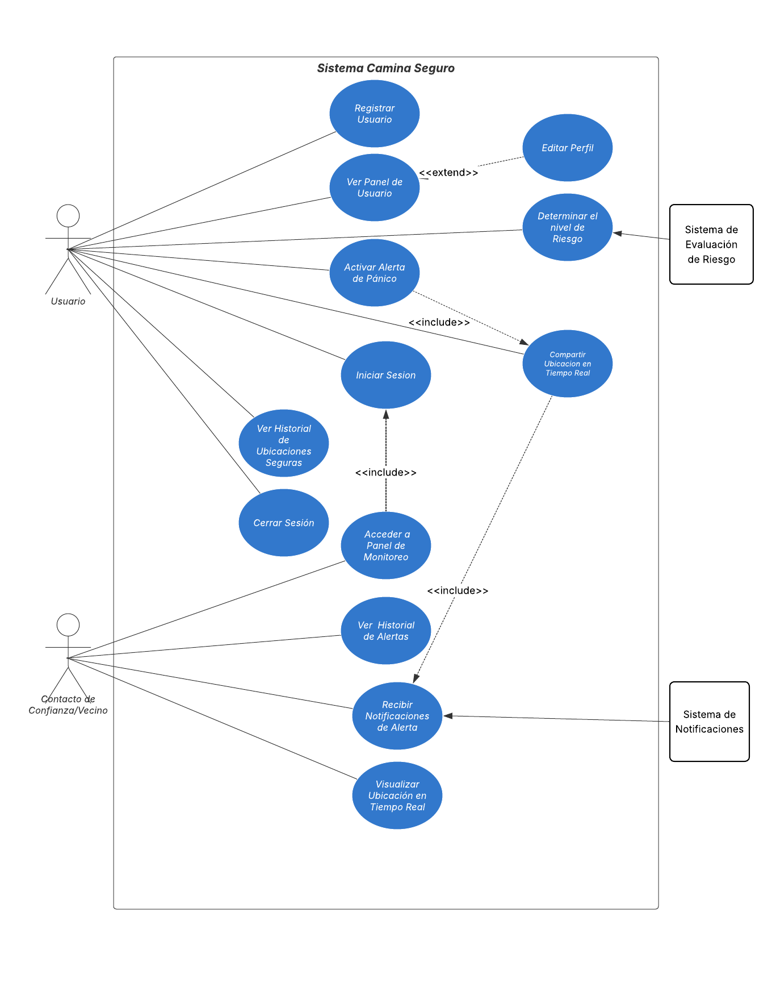
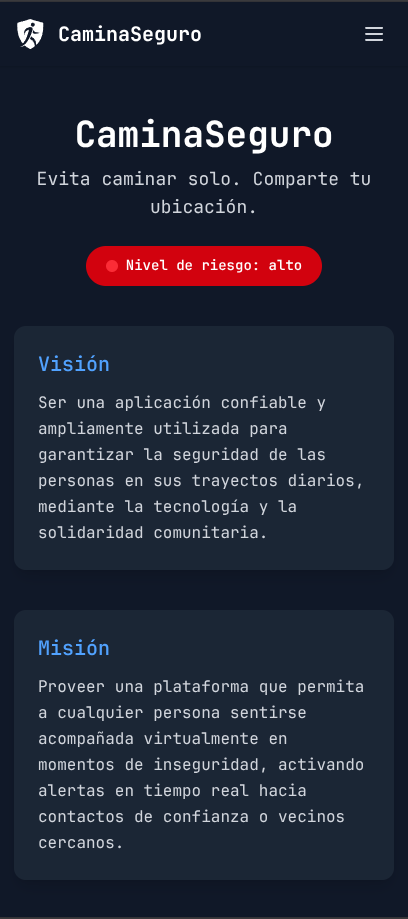
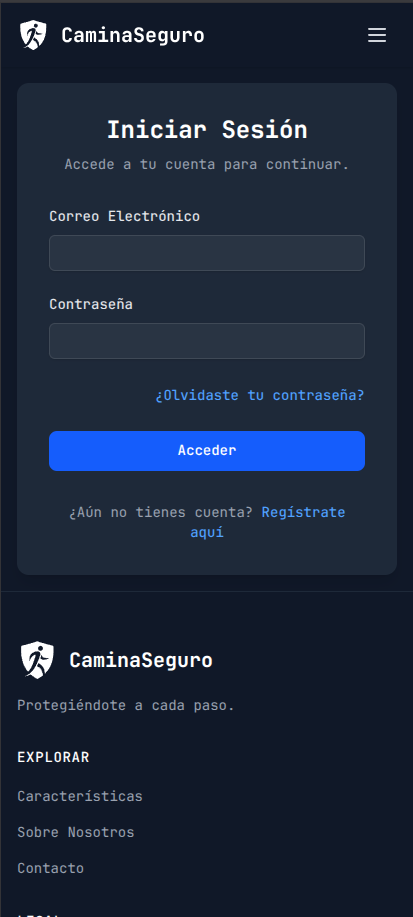
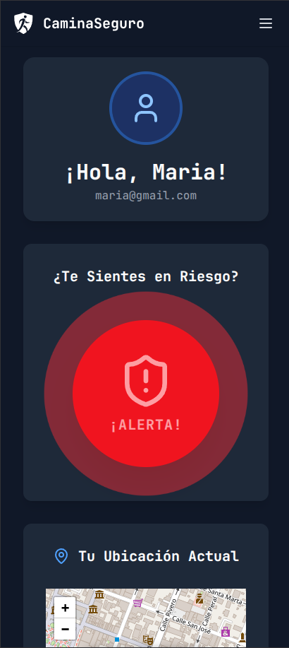
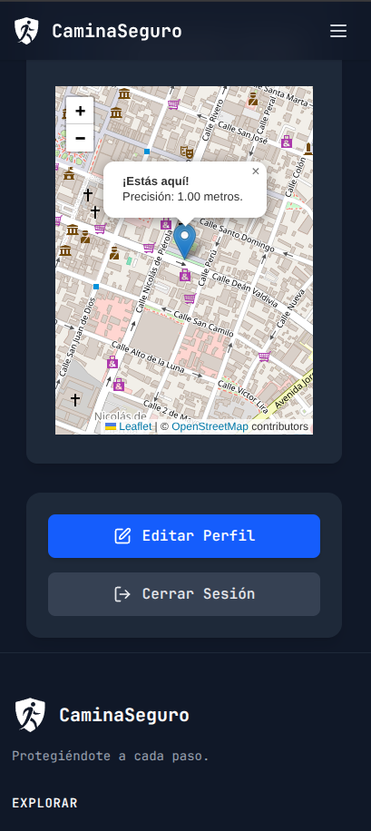
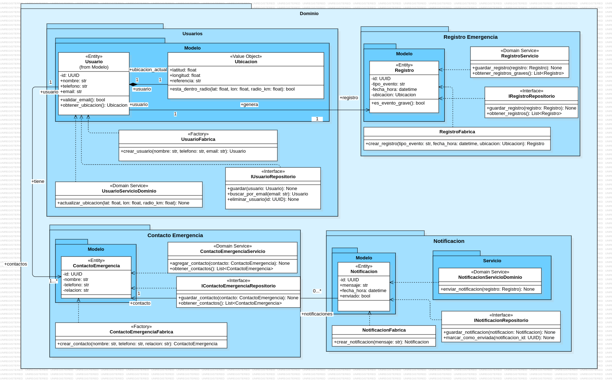
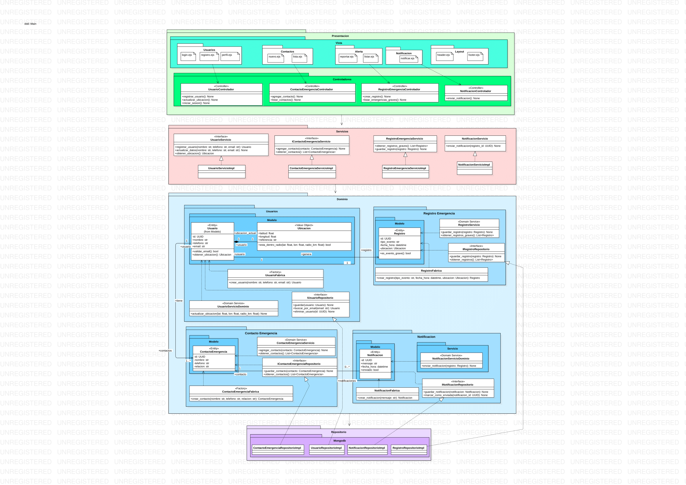

<div align="center">
  
</div>


---

## Índice

- [Integrantes](#integrantes)
- [Guía de Instalación](#instalacion)
- [Funcionalidades y Prototipo](#gui)
  - [Functionalidades de alto nivel](#funcionalidades)
  - [Diagrama de casos de uso](#casos-de-uso)
  - [Prototipo](#prototipo)
- [Visión General de Arquitectura](#arquitectura)
  - [Modelo de Dominio](#modelo-de-dominio)
  - [Diagrama de Arquitectura](#diagrama-de-arquitectura)
- [Prácticas de Desarrollo Aplicadas](#practicas)
  - [Estilos y Convenciones de Codificación](#estilos)
    - [Estilo Cookbook](#estilo-cookbook)
    - [Estilo por Interfaces](#estilo-interfaces)
  - [Codificación Limpia (Clean Code)](#clean-code)
  - [Principios SOLID](#principios-solid)
    - [Principio de Responsabilidad Unica](#principo-srp)
    - [Principio de Abierto/Cerrado](#principo-ocp)
    - [Principio de Inversión de Dependencias](#principo-dip)
  - [Domain-Driven Design (DDD)](#domain-driven-design)

---

<div id="integrantes">

## Integrantes

- Montañez Pacco, Roni Ezequiel
- Coloma Yujra, Riki Santher
- Enao Vilca, Roberto Carlos
- Taipe Huanca, Cristhian Luis
</div>

---

<div id="instalacion">

## Guía de Instalación

Para instalar este proyecto, por favor, sigue la guía correspondiente:

- [Guía de Instalación del backend](./backend/README.md)
- [Guía de Instalación del frontend](./frontend/README.md)

</div>

---

<div id="proposito">

## Propósito del proyecto

**"CaminaSeguro"** es una aplicación web de seguridad personal diseñada para ofrecer tranquilidad a las personas durante sus trayectos diarios. Su propósito es proveer un sistema de acompañamiento virtual que permite a los usuarios activar una alerta en tiempo real, notificando a sus contactos de confianza y compartiendo su ubicación para facilitar una respuesta rápida en situaciones de riesgo.

</div>

<div id="gui">
## Funcionalidades y Prototipo (GUI)

La aplicación ofrece un panel de control centralizado desde donde el usuario puede gestionar su seguridad de forma intuitiva.

<div id="funcionalidades">

### Funcionalidades de Alto Nivel

- **Gestión de cuenta de usuario:** Registro, Inicio y Cierre de Sesión.
- **Activación de alerta de emergencia:** Notificación instantánea a contactos de confianza.
- **Visualización de ubicación:** Seguimiento en tiempo real en un mapa interactivo.
- **Gestión de contactos de emergencia:** CRUD para la lista de contactos.
</div>

<div id="casos-de-uso">

### Diagrama de casos de uso

<figure style="text-align: center;">
  
  <figcaption>Diagrama de casos de uso</figcaption>
</figure>
</div>

<div id="prototipo">

### Prototipo / Interfaz Gráfica de Usuario (GUI)

**Tecnologías Utilizadas**

| Área              | Tecnología              | Propósito                                                    |
| ----------------- | ----------------------- | ------------------------------------------------------------ |
| **Backend**       | Python                  | Lenguaje de programación principal.                          |
|                   | Django                  | Framework para construir la API RESTful.                     |
| **Frontend**      | Svelte                  | Framework para construir interfaces reactivas.               |
|                   | HTML / CSS              | Lenguajes de marcado y estilo para el diseño de la interfaz. |
|                   | JavaScript / TypeScript | Lenguajes de programación para el comportamiento y tipado.   |
| **Base de Datos** | MongoDB                 | Base de datos NoSQL orientada a documentos.                  |
| **Herramientas**  | Git / GitHub            | Sistema de control de versiones y repositorio.               |
|                   | SonarQube               | Análisis estático de la calidad del código.                  |

A continuación se muestran capturas de pantalla de la interfaz gráfica del usuario:

<div style="display: flex; flex-wrap: wrap; justify-content: center; gap: 15px;">
  
  
  
  
  </div>

</div>
</div>

---

<div id="arquitectura">

## Visión General de Arquitectura

El proyecto adopta una **Arquitectura por Capas** explícita, fuertemente influenciada por los principios de **Clean Architecture** y **Domain-Driven Design (DDD)**. Esta separación garantiza un bajo acoplamiento y una alta cohesión, facilitando la mantenibilidad y la escalabilidad del sistema.

- **Frontend (SvelteKit):** Sigue una arquitectura de componentes, donde la UI se divide en piezas reutilizables y con responsabilidades únicas.
- **Backend (Python/Django):** Implementa un estilo arquitectónico en 4 capas distintas:
  - **Presentación:** Controladores que manejan las peticiones HTTP.
  - **Aplicación:** Servicios que orquestan los casos de uso.
  - **Dominio:** Lógica de negocio pura (Entidades, Repositorios, etc.).
  - **Infraestructura:** Detalles técnicos como la conexión a la base de datos (MongoDB) y servicios externos.

<div id="modelo-de-dominio">

### Modelo de Dominio

El modelo de dominio se ha diseñado siguiendo los principios de DDD, separando las responsabilidades en módulos cohesivos como `usuarios` y `contacto_emergencia`.



</div>
<div id="diagrama-de-arquitectura">

### Diagrama de Arquitectura



</div>
</div>

---

<div id="practicas">

## Prácticas de Desarrollo Aplicadas

<div id="estilos">

### Estilos y Principios Aplicados

Estilo orientado a objetos (Object-Oriented Programming, OOP)
El diseño se basa en clases, encapsulación, responsabilidad única y composición.

Se encapsula la lógica de creación en una clase separada (UsuarioFabrica), en lugar de hacerlo directamente en la entidad.

<div id="estilo-cookbook">

#### Estilo Cookbook

El método crear_usuario(...) actúa como una receta clara y paso a paso para construir un objeto Usuario, asegurando que siempre se cree en un estado válido.

Estilo basado en patrones de diseño
Se implementa explícitamente el patrón Factory, usado comúnmente en DDD, para delegar y centralizar la creación de objetos con lógica adicional (como el hasheo de contraseñas).

```python
# DDD: Implementación del patrón Factory para la creación de la entidad Usuario.
# SOLID (SRP): La única responsabilidad de esta clase es crear instancias de Usuario.
from .modelo.usuario import Usuario
from ddd.infraestructura.servicios.servicio_hash import ServicioHash


class UsuarioFabrica:
    """
    Fábrica responsable de la creación de instancias de la entidad Usuario.

    Encapsula la lógica compleja de creación, como el hasheo de la contraseña,
    asegurando que los objetos se creen en un estado válido y consistente.
    Esto cumple con el patrón Factory de DDD.
    """

    def __init__(self, servicio_hash: ServicioHash):
        """
        Inicializa la fábrica con el servicio de hasheo.

        Args:
            servicio_hash (ServicioHash): El servicio para hashear contraseñas.
        """
        self._servicio_hash = servicio_hash

    def crear_usuario(self, nombre: str, email: str, password_plano: str) -> Usuario:
        """
        Crea una nueva instancia de Usuario, asegurando que la contraseña se hashee.

        Args:
            nombre (str): Nombre del usuario.
            email (str): Email del usuario.
            password_plano (str): Contraseña en texto plano.

        Returns:
            Usuario: Una nueva instancia de la entidad Usuario con la contraseña hasheada.
        """
        password_hasheado = self._servicio_hash.hash_password(password_plano)
        return Usuario(nombre=nombre, email=email, password=password_hasheado)
```

</div>

<div id="estilo-interfaces">

#### Estilo por Interfaces (Interface-Based Programming)

El archivo define una interfaz abstracta (UsuarioRepositorio) con métodos que actúan como un contrato para las operaciones de acceso a datos relacionadas con la entidad Usuario.
Este estilo es característico de arquitecturas en capas como Clean Architecture o Hexagonal Architecture, donde se busca:
Separar completamente el dominio del almacenamiento.
Poder intercambiar fácilmente la implementación (por ejemplo, MongoDB, PostgreSQL, memoria, mocks).

```python
from abc import ABC, abstractmethod
from .modelo.usuario import Usuario


class UsuarioRepositorio(ABC):
    """
    Interfaz que define las operaciones de persistencia para la entidad Usuario.

    Actúa como un contrato que la capa de infraestructura debe implementar,
    desacoplando el dominio de los detalles de la base de datos.
    """

    @abstractmethod
    def guardar(self, usuario: Usuario) -> Usuario:
        """Guarda o actualiza una entidad de Usuario en el repositorio."""
        pass

    @abstractmethod
    def buscar_por_email(self, email: str) -> Usuario | None:
        """Busca un usuario por su dirección de email."""
        pass

    @abstractmethod
    def existe_email(self, email: str) -> bool:
        """Verifica si ya existe un usuario con un email determinado."""
        pass

    @abstractmethod
    def buscar_por_id(self, usuario_id: str) -> Usuario | None:
        """Busca un usuario por su ID único."""
        pass
```

</div>

</div>

<div id="clean-code">

### Codificación Limpia (Clean Code)

- **Nombres Expresivos:** Las variables y funciones tienen nombres que revelan su intención, como `evaluarRiesgo` o `ESTILOS_RIESGO`, lo que hace el código autoexplicativo.

  _Evidencia [riesgo.ts](frontend/src/lib/services/riesgo.ts):_

  ```typescript
  export function evaluarRiesgo(): { nivel: Riesgo; mensaje: string } {
    const hora = new Date().getHours();
    // ...
  }
  ```

- **Funciones Pequeñas y con una Sola Responsabilidad:** Funciones como `autenticarUsuario` tienen un único propósito, en este caso, comunicarse con el endpoint de login del backend.

  _Evidencia [+page.server.ts](frontend/src/routes/iniciar-sesion/+page.server.ts):_

  ```typescript
  async function autenticarUsuario(
    datos: z.infer<typeof esquemaLogin>,
  ): Promise<string> {
    const response = await fetch(`${BACKEND_API_BASE_URL}/api/auth/login/`, {
      // ...
    });

    if (!response.ok) {
      throw new Error("El correo o la contraseña son incorrectos.");
    }

    const { token } = await response.json();
    return token;
  }
  ```

- **Separación de Configuración y Lógica (DRY):** Los datos estáticos, como los enlaces del footer, se centralizan en archivos de configuración para evitar la duplicación.

  _Evidencia [footer.ts](frontend/src/lib/config/footer.ts):_

  ```typescript
  export const exploreLinks: FooterLink[] = [
    { href: "/features", text: "Características" },
    { href: "/about", text: "Sobre Nosotros" },
    { href: "/contact", text: "Contacto" },
  ];
  ```

</div>

<div id="principios-solid">

### Principios SOLID

<div id="principo-srp">

- **Principio de Responsabilidad Única (SRP):** Cada componente y módulo tiene una única razón para cambiar. `UserActions.svelte` solo se ocupa de renderizar los botones de acción del panel.

  _Evidencia [UserActions.svelte](frontend/src/routes/panel/UserActions.svelte):_

  ```html
  <script lang="ts">
    /**
     * @description SOLID (SRP): Su única responsabilidad es mostrar botones de acción
     * como "Editar Perfil" y "Cerrar Sesión".
     */
    import { Edit, LogOut } from "lucide-svelte";
  </script>

  <div class="rounded-2xl bg-white p-6 shadow-lg sm:p-8 dark:bg-gray-800">
    <!-- ... -->
  </div>
  ```

  </div>

<div id="principo-ocp">

- **Principio de Abierto/Cerrado (OCP):** Los componentes están abiertos a la extensión pero cerrados a la modificación. `Card.svelte` puede renderizar cualquier contenido en su cabecera y cuerpo a través de _snippets_ (slots), sin necesidad de modificar su código interno.

  _Evidencia [Card.Svelte](frontend/src/lib/components/ui/Card.svelte):_

  ```html
  <script lang="ts">
    let {
      children,
      header,
      class: extraClasses = "",
    }: {
      children: Snippet;
      header?: Snippet;
      class?: string;
    } = $props();
  </script>

  <div class="flex w-full ... {extraClasses}">
    {#if header} {@render header()} {/if}
    <div class="mt-8 flex-grow">{@render children()}</div>
  </div>
  ```

  </div>

<div id="principo-dip">

- **Principio de Inversión de Dependencias (DIP):** Los módulos de alto nivel no dependen de los de bajo nivel, sino de abstracciones. `UsuarioServicioImpl` depende de la interfaz `UsuarioRepositorio`, no de la implementación concreta de MongoDB.

  _Evidencia [usuario_servicio_impl.py](backend/ddd/aplicacion/usuario_servicio_impl.py):_

  ```python
  class UsuarioServicioImpl(UsuarioServicio):
      def __init__(
          self,
          usuario_repositorio: UsuarioRepositorio,
          # ...
      ):
          self.usuario_repositorio = usuario_repositorio
          # ...
  ```

</div>

</div>

<div id="domain-driven-design">

### Domain-Driven Design (DDD)

- **Entidades:** Objetos con identidad propia. `Usuario` es una entidad principal.

  _Evidencia [usuario.py](backend/ddd/dominio/usuarios/modelo/usuario.py):_

  ```python
  from mongoengine import Document, StringField, UUIDField
  from uuid import uuid4

  class Usuario(Document):
      id = UUIDField(primary_key=True, default=uuid4)
      nombre = StringField(required=True, max_length=150)
      # ...
  ```

- **Fábricas:** Encapsulan la lógica de creación de objetos complejos. `UsuarioFabrica` se encarga de crear usuarios con contraseñas hasheadas.

  _Evidencia [usuario_fabrica.py](backend/ddd/dominio/usuarios/usuario_fabrica.py):_

  ```python
  class UsuarioFabrica:
      def crear_usuario(self, nombre: str, email: str, password_plano: str) -> Usuario:
          password_hasheado = self._servicio_hash.hash_password(password_plano)
          return Usuario(nombre=nombre, email=email, password=password_hasheado)
  ```

- **Repositorios:** Abstraen la lógica de persistencia. La interfaz `UsuarioRepositorio` se define en el dominio, y la implementación `MongoUsuarioRepositorio` en la infraestructura.

  _Evidencia [usuario_repositorio.py](backend/ddd/dominio/usuarios/usuario_repositorio.py):_

  ```python
  from abc import ABC, abstractmethod

  class UsuarioRepositorio(ABC):
      @abstractmethod
      def guardar(self, usuario: Usuario) -> Usuario:
          pass
  ```

- **Arquitectura en Capas:** El backend está claramente dividido en capas `presentacion`, `aplicacion`, `dominio` e `infraestructura`, como se evidencia en la estructura de directorios del proyecto.

</div>

</div>
